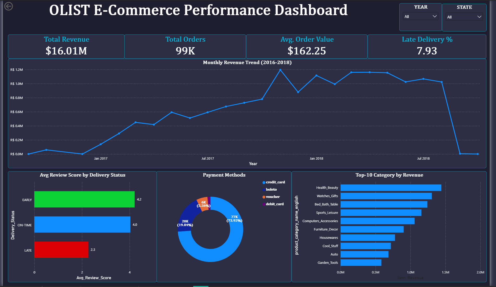
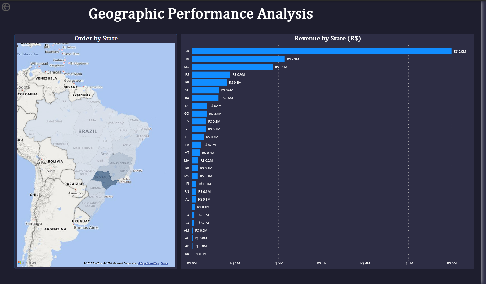
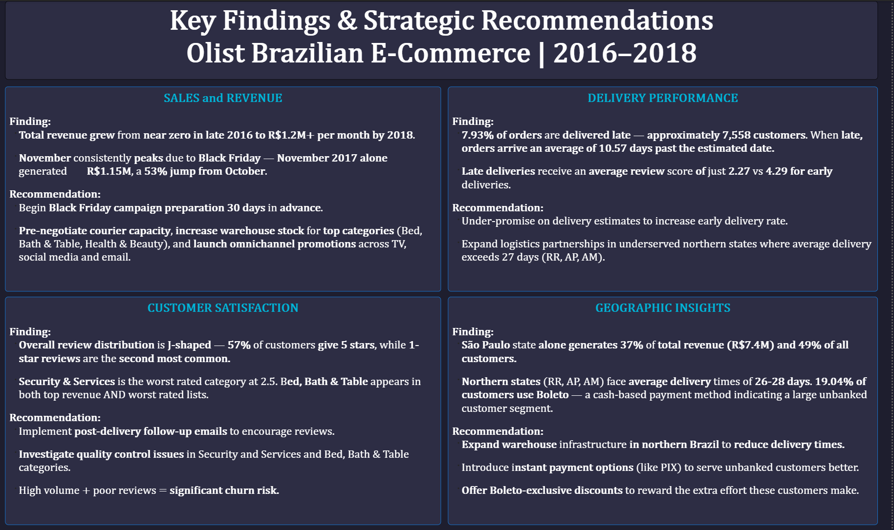

# Olist_e-Commerce_Analysis
End-to-End data analysis project using Python, MySQL,  and Power BI

# 🛒 Olist E-Commerce Data Analysis

## 📊 Project Overview
This project presents an end-to-end analysis of the Brazilian Olist e-commerce dataset to uncover actionable insights related to sales performance, customer behavior, delivery efficiency, and regional trends.

The analysis is performed using **Python for data processing**, **SQL for querying**, and **Power BI for visualization**, simulating a real-world business intelligence workflow.
---
> This project simulates a real-world business analysis workflow from raw data to actionable insights.
---
## ❓ Problem Statement
The objective of this project is to analyze Olist's e-commerce data to identify key drivers of revenue, customer satisfaction, and operational inefficiencies.

## 🎯 Objectives
- Analyze revenue growth and seasonal trends  
- Identify top-performing product categories  
- Understand customer payment behavior  
- Evaluate delivery performance and its impact on satisfaction  
- Identify geographic opportunities for expansion  

---
## 📌 Key Metrics Snapshot
- Total Orders: 99,000
- Revenue: R$ 16.01 Million
- Late Delivery Rate: 7.93%
- Avg Delay: 10.57 days
- 5-Star Reviews: 57%
---
## 🛠️ Tools & Technologies
- **Python** (Pandas, NumPy, Matplotlib, Seaborn)  
- **SQL** (MySQL)  
- **Power BI**  
---
## 🧾 SQL Analysis

SQL was used to transform raw data into actionable insights across multiple dimensions of the business.

- **Data Preparation:** Created relational tables and loaded multiple datasets with proper formatting and validation  
- **Performance Optimization:** Used indexing to improve query efficiency  
- **Revenue Analysis:** Monthly trends, MoM growth (CTE + LAG), and running totals (window functions)  
- **Delivery Performance:** Late delivery rate and its impact on customer reviews  
- **Customer Insights:** Identified high-value customers using subqueries  
- **Product & Category Analysis:** Top-performing categories and AOV vs volume behavior  
- **Geographic Insights:** State-wise revenue and identification of logistics bottlenecks  
- **Seller Analysis:** Ranked sellers based on revenue contribution  

**Key SQL Concepts Used:**  
CTEs, Window Functions (LAG, SUM OVER), Subqueries, Joins, Aggregations  

📄 Full SQL workflow available in: `sql/Olist_Analysis.sql`.
---

## 📂 Project Structure
- notebooks/ → Python data analysis
- sql/ → SQL queries
- assets/ → Dashboard screenshots
- data/ → Dataset reference

---

## 📊 Dashboard Preview

### 📌 Page 1 – Sales & Revenue Overview

---

### 📌 Page 2 – Geographic Analysis

---

### 📌 Page 3 – Recommendations

---
## 📊 Power BI Dashboard File

Due to file size limitations, the Power BI dashboard file is hosted externally.

🔗 **Download Dashboard (.pbix):**  
[Click here to access the Dashboard](https://drive.google.com/file/d/1BAU8_466LinyOzzB3wHg-VFq1AFbZCXJ/view?usp=sharing)

> Note: The file may take a few seconds to download due to its size.
---
## 🔍 Key Insights

- **Strong Growth:** Revenue scaled rapidly (2016–2018), consistently crossing **R$1M/month**, with a major spike during **Black Friday (+53% MoM)**.

- **Category Dynamics:**  
  - **Bed, Bath & Table** and **Health & Beauty** dominate revenue and volume  
  - **Computers** → high AOV  
  - **Sports & Leisure** → high volume, low value  

- **Payment Behavior:**  
  - **74% credit card**, **19% boleto**  
  - Indicates a significant **underbanked customer segment (~20%)**

- **Delivery Impact:**  
  - ~**8% orders delayed**, avg delay **10+ days**  
  - Ratings drop from **4.29 → 2.27** when late  
  - → **Biggest driver of customer dissatisfaction**

- **Customer Experience:**  
  - **57% 5-star reviews**, but high **1-star share**  
  - → Indicates a **polarized experience**

- **Product Risk:**  
  - **Bed, Bath & Table** = high revenue but poor ratings  
  - → **High churn risk category**

- **Geographic Gap:**  
  - **São Paulo dominates** (37% revenue, 49% customers)  
  - Northern states → **2x delivery time + low revenue**  
  - → **Major untapped opportunity**
 
## 📈 Business Impact

- Reduce delivery delays → improve customer satisfaction  
- Leverage seasonal spikes (Black Friday) → maximize revenue  
- Fix quality issues in key categories → reduce churn  
- Target boleto users → unlock additional demand  
- Expand in underserved regions → drive growth  
---
## 💡 Business Recommendations

1. **Leverage Seasonal Demand**
   - November spike (+53%) shows strong seasonal potential.
   - Prepare inventory, logistics, and campaigns **30 days in advance**.

2. **Fix Delivery Delays (Critical Priority)**
   - Late deliveries significantly reduce customer satisfaction.
   - Improve delivery estimates and expand logistics partnerships.

3. **Improve Product Quality Control**
   - Focus on **Bed, Bath & Table** category.
   - High revenue + poor reviews = high churn risk.

4. **Target Boleto Users**
   - ~19% customers rely on boleto.
   - Introduce **boleto-specific offers and flexible payment options**.

5. **Expand in Underserved Regions**
   - Northern states show low revenue but high potential.
   - Increase **local seller onboarding** to improve delivery speed and coverage.

---

## 📁 Dataset Information
The dataset used in this project is sourced from Kaggle and consists of multiple CSV files representing different aspects of an e-commerce platform.

👉 Refer to: `data/dataset_source.md`

---

## 👤 Author
**Abhineet Gaur**
